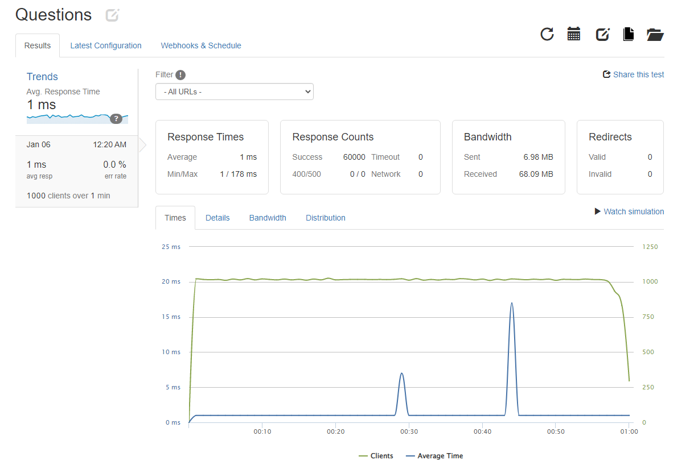
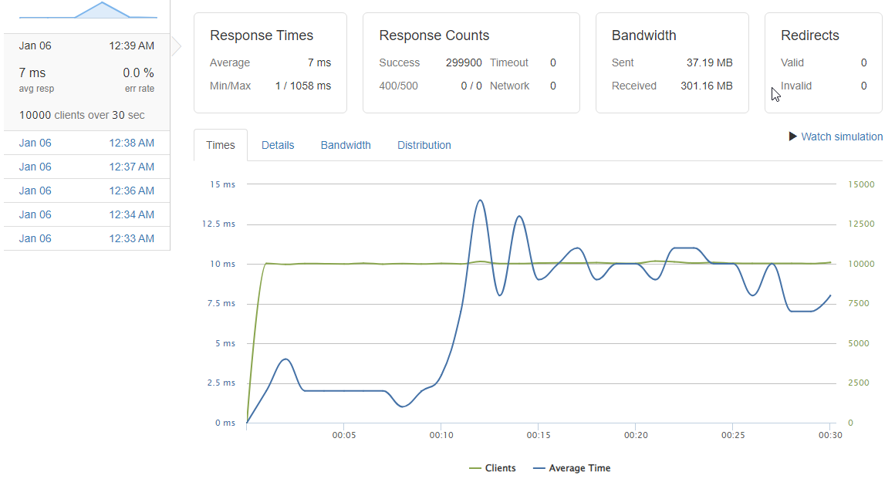

# Questions & Answers API

### General Info

- This project serves as the backend design for Project Atelier, an e-commerce company.
- This server handles the Questions & Answers of the individual products.
- An ETL process was used to parse millions of rows of data and optimize the schema.
- The database was created with PostgreSQL.
- Load balancing and Caching was implemented utilizing Nginx.

### Perfomance

Back End Architecture utilizes AWS to deploy a load balancer with a cache, 4 servers, and a Postgres database. All load tests performed via Loader.io.

  
Typical Load Performance

Perfomance at typical load of 1000 clients per second. 1ms latency and 0% error rate.

#### Typical 1000 RPS Load

### Optimization

Cache Implementation

Cache and load balancer implemented using Nginx - Latency increased to 7ms, but was able to push performance and be able to handle 10,000 rps. Through a cached implementation and proper load balancing, the server was able to maintain a 0% error rate.

#### Performance Metrics

### Tech Stack

  

Questions & Answers: Mo Akbari\

